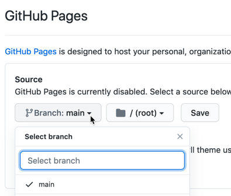

# cth-storymaps
Leaflet Storymaps customized for CT Humanities with multi-map setup using uploaded CSV data files, not a linked Google Sheet. Based on [Leaflet Storymaps with Google Sheets](https://github.com/HandsOnDataViz/leaflet-storymaps-with-google-sheets) by Jack Dougherty and Ilya Ilyankou, authors of *Hands-On Data Visualization* https://HandsOnDataViz.org/leaflet-storymaps-with-google-sheets.html

## Live link to index page for storymaps
- https://cthumanities.github.io/cth-storymaps/index.html
- or
- https://jackdougherty.github.io/cth-storymaps/index.html

## One-time steps to create a linked copy of CTHumanities repository and publish on GitHub Pages

1. Go to Jack's version of the cth-storymaps GitHub repository at https://github.com/jackdougherty/cth-storymaps
2. In upper-right corner, log into your CTHumanities GitHub account
3. In upper-right corner, click the *Fork* button, to create a *linked* copy in the CTH GitHub account.
4. Your linked copy of the repository will appear in your GitHub account at https://github.com/cthumanities/cth-storymaps
5. You can automatically publish your cth-storymaps content on the web with the free GitHub Pages feature. In upper-right corner, click the *Settings* button, scroll down to *GitHub Pages* section, select *Source > Main*, and press *Save*.



6. Wait about 30-60 seconds, and your cth-storymaps content, plus any updates you make to your GitHub repository, will appear online at: https://cthumanities.github.io/cth-storymaps/index.html

One advantage of creating a *linked* copy from Jack's GitHub repository is that in the future, if you wish to contract him to do more work, he can edit content in his repository and *push* changes to your repository, which you can accept (or reject) with a button.

PS: Also, follow same steps to make a linked copy of: https://github.com/jackdougherty/cth-storymaps-practice and your version will be named: https://github.com/cthumanities/cth-storymaps-practice

## Organization of contents
- README.md -- this page of instructions
- `index.html` -- list of links to the 13 storymaps, plus a sample embedded iframe
- `architecture.html` and similar -- the home HTML page for each storymap
- `media` folder -- contains subfolders (such as `architecture`) with images
- `csv` folder -- contains two data files for each map in Comma-Separated Values (CSV) format
    - architecture-chapters.csv   (and similar names)
    - architecture-options.csv   (and similar names)
- other folders such as `scripts` and `css` contain the code to run the storymaps, so don't mess with those unless you know what you're doing


## CTH needs to decide
Where do you wish to host and publish your storymaps?

- You can continue to host and publish from your free GitHub account.

OR

- Host and publish from your CTH web server. Keep the GitHub account as a backup, and in upper-right corner go to *Code > Download Zip* to download all contents into one folder in your local computer. If you wish, you can rename the folder to `storymaps`, and upload it directly to the root level of your WordPress site, and all content would appear under this web address: https://cthumanities.org/storymaps      

Ask me if you want to see a demo or discuss related options.

## To Edit an Existing Storymap
Do not use Google Sheets, since all existing data is stored in CSV format in this folder.

1. Download a copy of all content to your local computer
2. In the `csv` folder, use any spreadsheet tool to open the `architecture-chapters.csv` to edit map content, or `architecture-options.csv` to edit map settings.
3. Re-save the sheet in CSV format with the same name.
4. Log into your GitHub repository, and upload to the CSV folder


## To Create a New Storymap
- Create new storymaps in your cth-practice repository
- choose a short and unique keyword for each new storymap (such as *architecture* or *ridgefield-business*)
- in `media` folder, create subfolder with keyword name (such as `architecture`), and upload images (JPG or PNG) or other media
- in the spreadsheet template, make sure that pathnames to media files follow the format above, such as `media/architecture/image.jpg`
- in Google Sheets, File > Download as CSV, *carefully* rename to keyword-options.csv and keyword-chapters.csv *with no internal spaces*, then upload to `csv` folder
- in project folder, create duplicate of existing storymap file (such as `architecture.html`), rename to keyword.html, and modify pathnames to the CSV files in this section of the code:
  ```
  <!-- edit pathnames to map data for options and chapters -->
  <script>
    $(window).on('load', function() {
      initStorymap(
        'csv/architecture-options.csv',
        'csv/architecture-chapters.csv'
      );
    })
  </script>
  ```
- in the `index.html` file, add new link to your keyword.html storymap

#### Geocode your address data with Google Sheets add-on
To geocode (find latitude and longitude coordinates), we recommend installing the free [Geocoding by SmartMonkey add-on for Google Sheets](https://gsuite.google.com/marketplace/app/geocoding_by_smartmonkey/1033231575312). Insert your addresses in place of the samples in the Geocoding Details tab, then use Add-Ons > Geocoding > Geocode Details menu. Learn more in *Hands-On Data Visualization* https://handsondataviz.org/geocode.html


